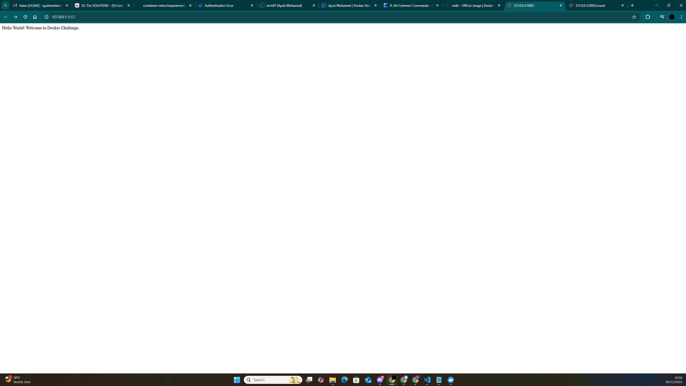
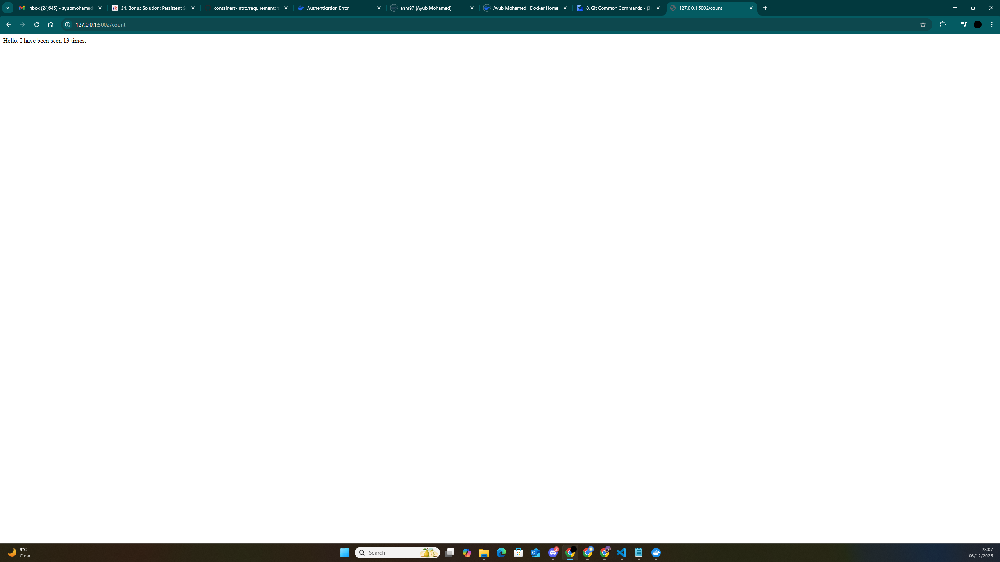

# Docker-Challenge 
---

## Challenge Objectives 

Build a multi-container application consisting of: 
- A Python Flask web application
- A Redis database
- Dockerised services
- A docker-compose.yml orchestrating both containers

---
## overview 

Design a simple multi-container application using flask and redis to show a welcome page and track number of page visits. This project will allow you to utlise and understand how container networking and servoices communicate.  

---
## Architecture 
This project runs a multi-container architecture consisting of: 

Flask web application 
- Handling incoming HTTP traffic.
- Exposes two routes (/ and /count) on the same network 
- Applying redit database to store and show visit count.
- apply docker volume for data perssitance during container stop and restart

Docker
- Pull a redis image from docker hub
- docker compose manages startup and network configuration for both services.   

---

## What i  built 
A Web page with a simple welcome page on http://localhost:5000/. To show application is up and running. 
A second page to demonstrate the visit count on http://localhost:5000/count.

--- 
## What i Learned in this project. 
- How to write up a dockerfile to create a docker image 
- How to create and run two containers concurrently through docker compose
- Netwroking communication between two containers. 
- Using docker volume to persist data as containers are statless by default.   
---

## Screenshots 
### Flask Welcome Page 

### Count Page 

---
### Commands used   
- docker build 
- docker-compose up
- docker ps    

